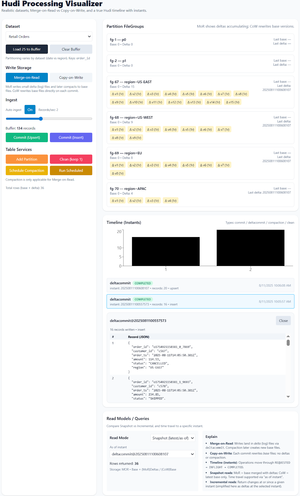

# Hudi Processing Visualizer

An interactive **React + Vite** app that demonstrates how **Apache Hudi** processes and manages data — from ingestion to commits, **Merge-on-Read (MoR)** vs **Copy-on-Write (CoW)** storage, **timeline instants** (`REQUESTED → INFLIGHT → COMPLETED`), **compaction**, **cleaning**, and **read simulation** with **time travel**.



---

## Table of contents
- [Features](#-features)
- [Quickstart](#-quickstart)
- [Project structure](#-project-structure)
- [How to use the visualizer](#-how-to-use-the-visualizer)
- [ASCII diagrams](#-ascii-diagrams)
  - [Data flow](#data-flow)
  - [MoR vs CoW](#mor-vs-cow)
  - [Timeline (instants)](#timeline-instants)
  - [Read simulation & time travel](#read-simulation--time-travel)
- [Datasets](#-datasets)
- [Read model details](#-read-model-details)
- [Table services](#-table-services)
- [Troubleshooting](#-troubleshooting)
- [Tech stack](#-tech-stack)
- [Notes](#-notes)
- [License](#-license)

---

## ✨ Features

### 📊 Realistic example datasets
Three built-in datasets with different partitioning strategies:
- **NYC Taxi Trips** — partitioned by pickup **date** (`dt=YYYY-MM-DD`)
- **Retail Orders** — partitioned by **region** (`region=US-EAST|US-WEST|EU|APAC`)
- **GitHub Events** — partitioned by event **date** (`dt=YYYY-MM-DD`)

Each dataset generates realistic JSON records with stable keys and timestamps.

### 🗄 Storage modes: Merge-on-Read (MoR) vs Copy-on-Write (CoW)
- **MoR**: writes land in small **delta** (log) files via `deltacommit`; **compaction** later creates new **base** files.
- **CoW**: each `commit` rewrites **base** files directly; there are no delta files, and no compaction.

### ⏱ Hudi timeline (instants)
- **Types**: `commit`, `deltacommit`, `compaction`, `clean`
- **States**: `REQUESTED → INFLIGHT → COMPLETED`
- Click any instant to see the **exact records** written (first 200 shown for large batches).

### 🧹 Table services
- **Compaction** (MoR only): schedule → run scheduled to merge deltas into a new base version.
- **Cleaning**: remove older base versions (e.g., **keep 1**).
- **Add Partition**: create a new file group/partition on the fly.

### 📥 Ingestion controls
- **Auto ingest** (0–5 records/sec)
- **Load 25** into buffer (manual)
- **Commit** buffered records as **Upsert** or **Insert**

### 📑 Read simulator
- **Snapshot** reads
  - MoR: **Base + Deltas** (as-of instant)
  - CoW: **Base only** (as-of instant)
- **Incremental** reads: simplified as **deltas at a selected instant**
- **Time travel**: run both read types **as of** a chosen instant on the timeline

### 📈 Visualization
- Per-partition **FileGroup** cards show **Base** and **Delta** versions/counts
- **Timeline chart** (bar) showing records per instant
- **Instant drawer** with JSON payloads

---

## 🚀 Quickstart

### 1) Prerequisites
- [Node.js](https://nodejs.org/) **v18+** (includes npm)

### 2) Install
```bash
npm install
```

### 3) Run
```bash
npm run dev
```
Open the printed URL (e.g. `http://localhost:5173/`).

---

## 📂 Project structure
```
src/
  App.jsx        # Main component & logic (datasets, storage modes, timeline, services, read sim)
  main.jsx       # Entry point (React 18 root)
  index.css      # Tailwind base styles
index.html
vite.config.js   # Vite + @vitejs/plugin-react
tailwind.config.js
postcss.config.js
```

---

## 🕹 How to use the visualizer

1. **Dataset**  
   - Choose one of: NYC Taxi Trips / Retail Orders / GitHub Events  
   - Click **Load 25 to Buffer** to enqueue 25 records (or enable **Auto ingest**)

2. **Write storage**  
   - Toggle **Merge-on-Read** or **Copy-on-Write**  
   - MoR creates **delta** files on commit; CoW rewrites **base** files

3. **Ingest & commit**  
   - Adjust **auto ingest** speed or load manually  
   - Click **Commit (Upsert)** or **Commit (Insert)** to write buffered records  
   - A new **instant** appears on the Timeline

4. **Table services**  
   - **Schedule Compaction** (MoR only) → **Run Scheduled** to merge deltas into a base  
   - **Clean (keep 1)** removes old base versions  
   - **Add Partition** creates a new file group

5. **Timeline**  
   - View the most recent instants (type, state, records, timestamp)  
   - Click an instant to inspect the **exact records** written (JSON view)

6. **Read simulator**  
   - Choose **Snapshot** or **Incremental**  
   - Optionally pick an **as-of instant** for **time travel**  
   - See **Rows returned** update according to storage mode and instant

---

## 🔍 ASCII diagrams

### Data flow
```
                 ┌────────────────────────────┐
                 │     Synthetic Datasets     │
                 │  (NYC Taxi / Retail / GH)  │
                 └──────────────┬─────────────┘
                                │  generate()
                         load / auto-ingest
                                ▼
                        ┌─────────────┐
                        │  BUFFER     │  ← user controls rate / load 25 / clear
                        └──────┬──────┘
                               │ Commit (Insert/Upsert)
                               ▼
                  ┌──────────────────────────────┐
                  │   FILE GROUPS (Partitions)   │
                  │  baseFiles[]    deltaFiles[] │
                  └─────────┬───────────┬────────┘
                            │           │
                       (CoW)│           │(MoR)
                  rewrite base       append delta
                            │           │
                            └─────┬─────┘
                                  ▼
                         ┌────────────────┐
                         │  TIMELINE      │
                         │ instants: type │
                         │ states: R/I/C  │
                         └───────┬────────┘
                                 │
                                 ▼
                           ┌─────────┐
                           │  READ   │ → snapshot / incremental (as-of instant)
                           └─────────┘
```

### MoR vs CoW
```
CoW (Copy-on-Write)                     MoR (Merge-on-Read)
---------------------                   -------------------
Commit → new BASE version               Deltacommit → new DELTA file
No delta files kept                     Compaction merges DELTAs → new BASE
Reads use BASE only                     Snapshot reads BASE + DELTAs (as-of)
No compaction                           Incremental reads typically use DELTAs
```

### Timeline (instants)
```
Each instant has: { instantTime, type, state, records, notes, writtenRecords? }

States: REQUESTED → INFLIGHT → COMPLETED

Examples:
  commit        (CoW writes)       : REQUESTED → INFLIGHT → COMPLETED
  deltacommit   (MoR writes)       : REQUESTED → INFLIGHT → COMPLETED
  compaction    (MoR only)         : REQUESTED → INFLIGHT → COMPLETED
  clean         (remove old base)  : REQUESTED → INFLIGHT → COMPLETED
```

### Read simulation & time travel
```
as-of instant filter:
  include files where file.instantTime <= asOf (if asOf is set)

Snapshot (mode-dependent):
  CoW: result = latest BASE rows (as-of)
  MoR: result = BASE rows + sum(DELTA rows) (as-of)

Incremental (simplified):
  result = sum(DELTA rows where delta.instantTime == asOf)
```

---

## 🧭 Datasets

| Name            | Key        | Partitioning                        | Example fields                               |
|-----------------|------------|-------------------------------------|----------------------------------------------|
| NYC Taxi Trips  | `trip_id`  | `dt=YYYY-MM-DD` (pickup date)       | passenger_count, total_amount, vendor_id, ts |
| Retail Orders   | `order_id` | `region=US-EAST\|US-WEST\|EU\|APAC` | customer_id, status, amount, order_ts        |
| GitHub Events   | `event_id` | `dt=YYYY-MM-DD` (event date)        | repo, type, actor, created_at                |

> Partition strings are shown on FileGroup cards (e.g., `dt=2025-08-10`, `region=EU`).

---

## 📚 Read model details

- **Snapshot (CoW)**: returns the latest **base** row count **as-of** the selected instant.
- **Snapshot (MoR)**: returns **base** + **delta** rows **as-of** the selected instant.
- **Incremental (simplified)**: returns all delta rows **at** the selected instant (`instantTime === asOf`).

> The simulator focuses on intuitive visualization; it doesn’t model deletes, record-level merge semantics, or indexes.

---

## 🧰 Table services

- **Compaction (MoR only)**  
  1) **Schedule Compaction** creates a `compaction` instant (REQUESTED).  
  2) **Run Scheduled** sets it INFLIGHT and merges **delta → base** across file groups, then marks it COMPLETED.

- **Cleaning**  
  - **Clean (keep 1)** removes older base versions per file group, keeping only the most recent base.

- **Add Partition**  
  - Adds a new `fileGroup` (e.g., `p2`, `p3`) to simulate growth in partitions.

---

## 🧩 Troubleshooting

**Dev server fails with _Cannot find package '@vitejs/plugin-react'_**
- Ensure your project has the React plugin:
  ```bash
  npm install -D @vitejs/plugin-react
  ```
  It’s already included in `devDependencies` in the provided project, but if you copied files into a new folder, re-run the install.

**Blank page or Tailwind styles missing**
- Make sure `index.css` includes Tailwind directives:
  ```css
  @tailwind base;
  @tailwind components;
  @tailwind utilities;
  ```
- Confirm `tailwind.config.js` has the correct `content` globs for `./index.html` and `./src/**/*.{js,jsx,ts,tsx}`.

**Node version issues**
- Use **Node 18+**. Older versions can cause ESM or plugin issues with Vite.

**Port already in use**
- Vite prints the port in the terminal; if it’s taken, run:
  ```bash
  npm run dev -- --port 5174
  ```

---

## 🏗 Tech stack
- **React 18**
- **Vite** (+ `@vitejs/plugin-react`)
- **Tailwind CSS**
- **Framer Motion**
- **Recharts**

---

## 📝 Notes
- This app is for **educational purposes** — it simplifies Hudi behaviors for clarity and interactivity.
- Data is generated locally; no backend or real Hudi table is involved.

---

## 📜 License
MIT — feel free to modify and adapt.
